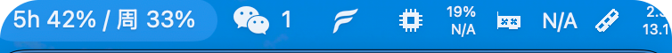
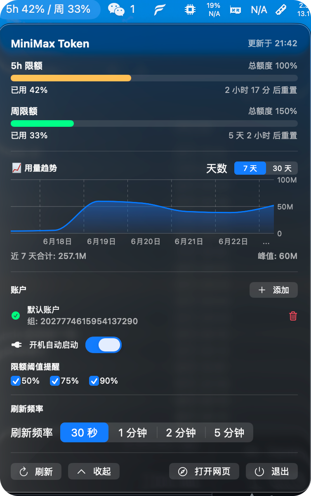

# MiniMaxMeter

[](LICENSE)
[]()
[]()
[]()

macOS 菜单栏小工具，实时监控 [platform.minimaxi.com](https://platform.minimaxi.com/console/usage) Token Plan 用量。

再也不用频繁打开网页看 token 剩多少——**菜单栏一行字**就能看到。

## 截图 / Screenshots

| 菜单栏 | 弹出卡片（含设置区）|
|---|---|
|  |  |

> 第一次贡献？上传截图到 `docs/` 目录并替换上面几行即可。

## 特性 / Features

- 🚀 **零运行时依赖**（纯 SwiftUI + Foundation）
- 🍎 **macOS 13+ 原生菜单栏**（不显示 Dock 图标）
- 🔐 **Cookie 存 macOS Keychain**（不明文落盘）
- ⏱ **倒计时实时刷新**（每秒）
- 📡 **接口失败自动降级**到本地缓存
- 🎨 **状态色**（< 30% 绿 / 30–70% 橙 / > 70% 红）
- 🛠 **一键安装脚本**（双击 .command 即可）

## 显示内容

**菜单栏**（永远可见）：
```
5h 25% / 周 18%
```

**点击展开小卡片**：
- 5h 限额进度条 + 倒计时
- 周限额进度条 + 倒计时
- 内嵌设置（Cookie / 刷新频率 / 退出）

## 数据来源 / Data Source

通过抓包 platform.minimaxi.com 内部 XHR 实现（**复用你自己浏览器的 Cookie**）。

- Endpoint: `https://www.minimaxi.com/v1/api/openplatform/coding_plan/remains`
- Method: GET
- 必带 Header: Cookie, Origin, Referer, X-Group-Id（**从 Cookie 自动提取**，不需手动配置）
- 字段映射: `model_remains[model_name="general"]` 里的 `current_interval_remaining_percent` / `current_weekly_remaining_percent` / `weekly_boost_permille` / `remains_time` / `weekly_remains_time`

## 隐私 / Privacy

- ✅ 全部代码本地运行，**不上传任何数据**
- ✅ Cookie 只存 macOS Keychain，**仅用于本工具调 API**
- ✅ 不发起任何 telemetry / 统计 / 远程上报
- ⚠️ Cookie 失效（通常几周）需要重新登录平台复制新 cookie

## 贡献 / Contributing

欢迎提 Issue / PR！详见 [CONTRIBUTING.md](CONTRIBUTING.md)。

- Bug Report: [`.github/ISSUE_TEMPLATE/bug_report.md`](.github/ISSUE_TEMPLATE/bug_report.md)
- Feature Request: [`.github/ISSUE_TEMPLATE/feature_request.md`](.github/ISSUE_TEMPLATE/feature_request.md)

## 许可 / License

[MIT](LICENSE) — 自由使用 / 修改 / 商用 / 分发。

## 安装（推荐，一次性）

需要 macOS 13+ 和 Xcode Command Line Tools（终端跑 `xcode-select --install` 检查）。

**第一步**：在 Finder 打开本目录，双击 **`install-安装.command`**
- 会自动编译、打包 .app、在桌面创建替身
- 等 30 秒编译完，桌面会出现「MiniMaxMeter」图标

**第二步**：双击桌面上的 **`MiniMaxMeter`** 启动
- 菜单栏右上角出现 `5h X% / 周 X%`（X=真实数字，说明 Cookie 已生效）
- **点菜单栏文字** → 弹出小卡片 → 底部 **「⚙ 设置」** → 填 Cookie → 保存

## 故障排查 / Troubleshooting

### 菜单栏显示 `5h 0% / 周 0%` 一直不变

按下面顺序排查：

1. **点「↻ 刷新」按钮**（在弹出卡片底部）—— 大多数情况是首次启动时机太早导致自动 refresh 没赶上
2. **检查 Cookie 是否还在 Keychain**：
   ```bash
   security find-generic-password -s com.MiniMax.MiniMaxMeter -a session-cookie
   ```
   - 看到条目 → Cookie 还在，看下面「接口失败」
   - 没看到 → 重新粘一次 Cookie 保存
3. **看 popover 里的红色错误提示**：
   - `Cookie 过期，请重新登录` → 浏览器重新登录 minimaxi 复制新 Cookie
   - `HTTP 401` / `HTTP 403` → 同上，Cookie 失效
   - `解码失败` → 接口改版了，提 Issue

### 验证 Cookie 是否还有效

终端跑：

```bash
COOKIE=$(security find-generic-password -s com.MiniMax.MiniMaxMeter -a session-cookie -w)
curl -s -H "Cookie: $COOKIE" -H "X-Group-Id: $(echo $COOKIE | grep -oE 'minimax_group_id_v2=[0-9]+' | cut -d= -f2)" \
  https://www.minimaxi.com/v1/api/openplatform/coding_plan/remains | head -c 200
```

- 返回 JSON 含 `model_remains` → Cookie 有效
- 返回 `cookie is missing` → Cookie 已失效，重新登录

### 启动后没数据但点刷新就好

- ✅ **正常**：首次启动时机太早（Mac 刚开机、网络还没就绪）。手动点「↻ 刷新」立刻拉一次。
- ✅ **新版已修**：`UsageStore.init()` 自动调用 `start()`，启动后 1 秒内自动拉数据（v1.1.1+）

以后每次想用，**双击桌面图标**就行（不用碰终端）。

> 第一次双击桌面图标如果 macOS 弹「无法打开，因为来自身份不明的开发者」→ **右键点击图标 → 打开 → 打开**，之后就能正常双击了。

## 启动 / 卸载

- **从桌面启动**：双击 `~/Desktop/MiniMaxMeter.app` 替身
- **从终端启动**：双击本目录的 `start-启动.command`
- **完全卸载**：双击本目录的 `uninstall-卸载.command`（删 .app + 桌面替身 + 编译产物）

## 编译运行（开发者用）

如果想改代码后跑起来看效果：

```bash
swift run --package-path /Users/a1/AI-Hub/projects/MiniMaxMeter-迷你魔用量监控
```

或：

```bash
cd ~/AI-Hub/projects/MiniMaxMeter-迷你魔用量监控 && swift run
```

## 配置 Cookie

1. Chrome 打开 https://platform.minimaxi.com/console/usage 并登录
2. F12 打开 DevTools → **Network** 面板
3. **F5 刷新一次页面**
4. 顶部 Filter 框输入 `usage`，列表剩 2 条
5. 点 **`usage`**（不是 usage_summary）
6. 右侧 **Headers** tab → 顶部 **Request URL** 确认是 `https://www.minimaxi.com/v1/api/openplatform/coding_plan/remains`
7. 向下滚到 **Request Headers** → 找 **`cookie:`** 那一行（**全部小写**）
8. 右键 → **Copy value**（**只复制值**，不带 `cookie:` 前缀）
9. 点菜单栏的 `5h X%` → 弹出小卡片 → 底部 **设置** → 粘到 Cookie 输入框 → **保存**

Cookie 存到 macOS Keychain，不明文落盘。`X-Group-Id` 会从 cookie 里 `minimax_group_id_v2=...` 自动提取，不用单独填。

## 数据来源

接口：`/console/usage` 页面的内部 XHR（`usage`），通过复用浏览器 Cookie 鉴权。

字段映射：
- `model_remains[model_name="general"]`
  - `current_interval_remaining_percent` → 5h 剩余%
  - `current_weekly_remaining_percent` → 周剩余%
  - `weekly_boost_permille` → 周总额度‰
  - `remains_time` / `weekly_remains_time` → 倒计时

## 状态码

- 1 = active（正常）
- 3 = disabled（不显示，灰色）

颜色规则：已用 0–30% 绿、30–70% 橙、70%+ 红。

## 已知 TODO

- 如果 minimaxi 接口改版，更新 `UsageFetcher.swift` 的 `endpoint` URL
- 如果接口新增必需 header，在 `UsageFetcher.fetch()` 的 `req.setValue(...)` 处添加
- 改完代码后，**重新跑 `install-安装.command`** 重新编译桌面图标
